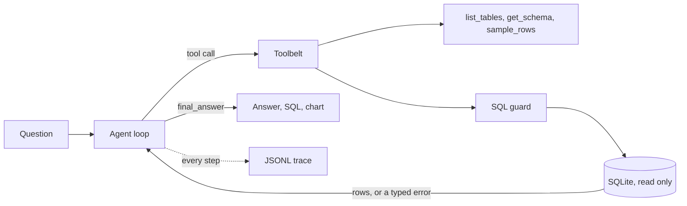

# QueryPilot

QueryPilot answers questions about a SQL database in plain English. You ask something like
"which five artists earned the most revenue?", and it reads the schema, writes the SQL, runs
it read-only, fixes the query itself if it fails, and gives you the answer along with every
step it took to get there.


*The clip is trimmed. The waiting between steps has been cut out, so the real app is slower
than it looks here. The run in the recording took 106 seconds end to end on Gemini Flash, and
the same question against a local model on a laptop GPU takes several minutes.*

The agent loop is written by hand. There is no LangChain and no LangGraph in this project,
just one OpenAI-compatible client, six tools, and a loop file you can read in a single
sitting. That was a deliberate choice: the interesting part of an agent is what it does when
a tool call fails, and a framework hides exactly that.

Status: phases 0 to 4 are done, and the app is live at
[querypilot.streamlit.app](https://querypilot-bq2osiqgeiomhfvdczfwrm.streamlit.app/).

## What it does

* **Looks before it leaps.** It lists the tables, pulls the schema for the ones it needs, and
  samples real rows when a filter depends on how values are actually stored.
* **Never writes to your database.** Every statement is parsed with sqlglot and rejected
  unless it is a single read-only SELECT. A row limit is injected, and the connection itself
  is opened in read-only mode with a query timeout, so a bug in the checker still cannot
  cause damage.
* **Fixes its own SQL.** A failed query goes back to the model as a typed error with a hint,
  and it rewrites the query. This is the behaviour the whole project is built to study.
* **Draws charts** when a comparison is easier to see than to read.
* **Runs on whatever you have.** Gemini, Groq, OpenRouter, or a local model through Ollama,
  all behind one client. Swapping providers is a config change, not a code change.
* **Shows its work.** Every run is recorded as a JSONL trace, and the app renders that trace
  step by step. The same traces replay in CI as regression tests.

## Try it

**[querypilot.streamlit.app](https://querypilot-bq2osiqgeiomhfvdczfwrm.streamlit.app/)**

The demo ships no shared key, so it runs on yours: pick Gemini, Groq or OpenRouter in the
sidebar and paste a free key from the link it shows you. That is the deliberate arrangement —
see the note on keys below. Community Cloud puts an idle app to sleep, so the first visit
after a quiet spell takes about 30 seconds to wake.

To run it on your own machine:

```bash
uv sync
uv run streamlit run app/streamlit_app.py
```

That is everything you need if you want to use a hosted model. Pick a provider in the sidebar
and paste a free API key. To run it with no key and no cost at all, install
[Ollama](https://ollama.com) and pull the model the project defaults to:

```bash
ollama pull qwen3:4b
```

Be realistic about the local option. It wants roughly 4GB of VRAM, a question takes a few
minutes rather than the one minute a hosted model needs, and a 4B model does not always
manage to finish a question that a hosted model handles comfortably.

One thing worth stating plainly about API keys. Streamlit runs on a server, so a key you
paste travels to whichever machine is hosting the app and is held in memory for the length of
your session. It is never written to disk, never recorded in a trace, and it is gone when the
session ends. On a public deployment you are trusting whoever runs it, which is exactly why
the intended setup is that visitors bring their own key rather than share one.

The app gives you:

* Two demo databases. Chinook is the classic one. The second is a synthetic retail database
  generated for this project from a fixed seed, so it is data that did not exist anywhere
  before this repo. You can also upload your own SQLite file, up to 20MB, opened read-only.
* A switch between **Agent** mode and **Single-shot** mode, per question. These are the same
  two setups the benchmark table below compares, so you can watch the difference instead of
  taking the numbers on trust.
* Four tabs on every answer: the SQL, the result table, the chart, and the trace. The trace
  tab is the agent's own log, including any query that failed and the retry that fixed it.
* Spending caps on every session, tighter when the app is running on an operator's shared key
  than when you bring your own. See [src/dbagent/budget.py](src/dbagent/budget.py).

## The benchmark numbers

Scored on execution accuracy: does the predicted query return the same rows as the
reference query.

On the **full BIRD Mini-Dev set, all 500 questions**, the local 4B model scores
**47.0%** (235/500, 95% CI [42.7, 51.4]) in single-shot mode, at 48 seconds per question
on a 6GB laptop GPU and no cost per query.

The three-way comparison below runs on a fixed 100-question subset, because cloud free
tiers and local wall-clock could not fund the other two configurations at full scale.
Every row is the same 100 questions:

| model | mode | accuracy | average latency | model calls |
|---|---|---|---|---|
| qwen3:4b, local on a 6GB laptop GPU | single-shot | **44.0%** | 54.5s | 1.00 |
| qwen3:4b, local on a 6GB laptop GPU | agent | 43.0% | 212.3s | 6.66 |
| gpt-oss-120b on Groq | single-shot | **50.0%** | 20.0s | 1.00 |

Two things worth saying plainly about this table.

A quantised 4B model running on a laptop lands within six points of a 120B hosted model,
on identical questions, at no cost per query. That is the good news.

**The agent and plain single-shot prompting are indistinguishable on accuracy.** 43.0%
against 44.0%, and paired on the same questions the agent wins 9 that single-shot loses
while losing 10 that single-shot wins. McNemar's exact test on those 19 discordant pairs
gives p = 1.000, which is as close to no difference as data gets. For that, agent mode
pays 6.7x the model calls and 3.9x the wall clock.

So on this benchmark, with this model, the loop does not answer more questions correctly.
It earns its place for other reasons: it shows its work, it can chart a result, and it does
not need the whole schema to fit in one prompt. That is a narrower claim than the project
set out to make, and it is the one the data supports. The
[full report](evals/reports/baseline.md) has the mechanism behind the individual losses,
and the arithmetic on what settling this properly would cost.

## How it works



One turn of the loop is one model call. The model either calls tools, in which case the
results are appended to the transcript and the loop goes round again, or it answers. The loop
enforces the limits that keep a demo safe and a bill small: at most twelve model calls per
question, and a nudge to stop and report after three failed queries in a row.

The guard is the part worth reading if you only read one file. It parses the SQL, checks that
there is exactly one statement, checks that the root is a plain query, then walks the whole
tree looking for anything that writes or reads the filesystem, because a DELETE can hide
inside a CTE.

## What is in the repo

```
src/dbagent/
  agent/loop.py         the agent loop, guards and self-correction
  agent/tools.py        the six tools and their JSON schemas
  agent/single_shot.py  the one-call baseline, shared with the eval harness
  db/guard.py           SQL safety checks
  db/database.py        read-only SQLite adapter with a timeout
  llm/client.py         one client, four providers
  budget.py             per-session and per-hour spending caps
  demo.py               demo databases, uploads, API key resolution
  tracing/tracer.py     JSONL traces
evals/                  benchmark loaders, runner, metrics, reports
app/streamlit_app.py    the demo app
tests/                  166 tests, none of which touch the network
```

## Development

```bash
# install uv first: https://docs.astral.sh/uv/
uv sync
cp .env.example .env   # add free API keys if you want to use a hosted model

uv run python scripts/smoke_test.py                  # check your providers respond
uv run python -m dbagent chat --provider ollama      # the agent in a terminal
uv run streamlit run app/streamlit_app.py            # the agent in a browser
uv run python -m dbagent eval --dataset chinook      # the accuracy harness
uv run pytest                                        # 166 tests, no network needed
```

The synthetic demo database is committed, so you only need to rebuild it if you change the
generator: `uv run python scripts/build_demo_dbs.py`.

## Roadmap

- [x] **Phase 0** Project setup and a smoke test across all four providers
- [x] **Phase 1** SQL toolbelt and safety layer: the sqlglot guard, read-only execution, six tools
- [x] **Phase 2** The agent loop: tool calling, self-correction, tracing, golden-trace replay in CI
- [x] **Phase 3** Evaluation harness and BIRD Mini-Dev baselines ([report](evals/reports/baseline.md))
- [x] **Phase 4** The Streamlit app: live trace viewer, bring-your-own-key, deployment configs
- [ ] **Phase 5** Error analysis of 50 failures, architecture write-up, version 1.0
- [ ] **Later** A QLoRA fine-tune of a small open model, and a GRPO ablation using execution
  results as the reward

## License

MIT
